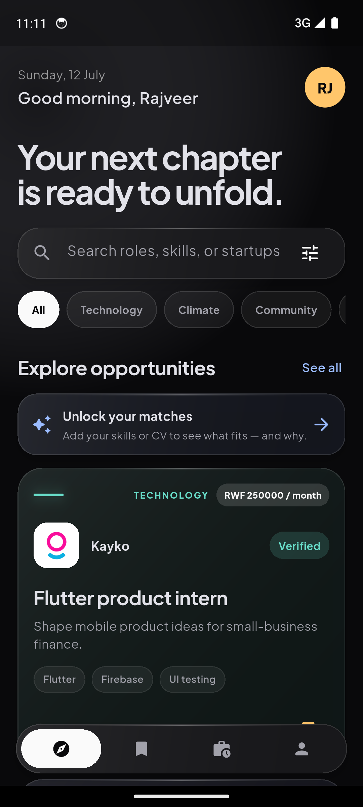

# Unfold

Unfold is an Android-first Flutter application that connects African Leadership University students with opportunities from student- and alumni-led ventures. Students can discover roles, filter the opportunity feed, save listings, submit applications, and track progress. Founders can publish opportunities and review applicants from a role-aware workspace.

Its differentiator is **explainable CV discovery**: a student can select a PDF CV, let Firebase AI Logic extract a concise skills summary, review the result, and use those signals to understand which roles fit. The app never allows AI to submit or decide an application.



## Current status

### Implemented

- Android Flutter application with a custom dark, glass-inspired visual system
- ALU-domain Google sign-in and email/password account creation
- Student and founder role selection and onboarding
- Firestore-backed user profiles
- Real-time Firestore opportunity feed with sourced prototype seed content as fallback
- Search plus category, compensation, and volunteering filters
- Opportunity details, save state, and application form
- Firestore-backed applications with submitted, reviewing, shortlisted, accepted, and rejected progress
- Founder opportunity publishing with type, compensation, currency, and contact email
- On-device PDF selection with an 8 MB limit and Firebase AI Logic analysis
- Riverpod state management
- Firestore security rules and indexes
- Widget, controller, model, and form tests
- Explicit paid/unpaid listings with RWF or USD monthly compensation
- Social-style profile with editable bio, location, class year, link, skills/interests, and a bounded cropped photo
- Rotating home messages, time-aware greetings, profile shortcut, and custom Unfold launcher/splash branding
- Pull-to-refresh across student and founder pages

### Deliberate prototype boundaries

- Saved opportunities persist per user in Firestore, with optimistic UI and a local fallback when the backend is unavailable.
- Opportunity repository methods support update and delete, but the current founder UI focuses on publishing.
- Founder Studio lets any authenticated user switch modes and publish a role; production moderation is out of scope.
- CV files are processed directly from memory and are not retained in Firebase Storage. Only the extracted summary is saved to the user's Firestore profile.
- Match scores in sourced fallback records are presentation fields. The UI does not expose them as personalized matches until CV/skill evidence exists.
- FlutterFire configuration is Android-only.

## Architecture

Unfold uses a small feature-first structure so the data flow stays explainable:

```text
widget
  -> Riverpod controller/provider
      -> repository interface
          -> Firebase Auth / Cloud Firestore
```

Key choices:

- **Flutter + Material 3** for the Android client
- **Riverpod** for session and feature state
- **Firebase Authentication** for Google and email/password sign-in
- **Cloud Firestore** for users, opportunities, and applications
- **Firebase AI Logic** for multimodal PDF analysis without embedding an AI-provider key
- Repository boundaries keep Firebase calls out of most widgets
- Firebase streams update opportunity and application views in real time

Firestore collections used or defined by the project:

```text
users/{userId}
startups/{startupId}
opportunities/{opportunityId}
applications/{applicationId}
bookmarks/{userId}/items/{opportunityId}
```

See [PROJECT_GUIDE.md](PROJECT_GUIDE.md) for a concise walkthrough.

## Project structure

```text
lib/
├── app/                    # root app and visual theme
├── core/                   # backend configuration and shared widgets
├── features/
│   ├── applications/       # form, model, repository, founder review
│   ├── auth/               # session, Firebase auth, and onboarding screens
│   ├── cv/                 # PDF validation and Firebase AI analysis
│   ├── home/               # shell plus focused views, sheets, and widgets
│   └── opportunities/      # model, seed data, repository, controller
├── firebase_options.dart   # generated Android Firebase options
└── main.dart
test/                       # widget, model, form, and controller tests
docs/                       # source notes and submission material
android/                    # Android host project and Google services config
```

## Requirements and local run

- Flutter SDK compatible with Dart `^3.11.5`
- Android SDK and an emulator or physical Android device
- Java 17
- A Firebase project when replacing the included configuration
- Firebase CLI and FlutterFire CLI for backend reconfiguration

```bash
flutter doctor -v
flutter devices
flutter pub get
flutter analyze
flutter test
flutter run
```

To select a device and build the submission-sized release APK:

```bash
flutter run -d <device-id>
flutter build apk --release --split-per-abi
```

For a modern Android phone, use `build/app/outputs/flutter-apk/app-arm64-v8a-release.apk`. The ABI-specific build keeps the shareable APK close to 22 MB without reducing visual quality.

## Firebase setup

The checked-in Android configuration targets Firebase project `unfold-f52a4` and application ID `com.alu.unfold.unfold`. Firebase web API keys and `google-services.json` identify the client; they are not server-side admin credentials. Never add service-account JSON or AI-provider secrets to Git.

For another Firebase project:

1. Register an Android app with package name `com.alu.unfold.unfold`.
2. Enable **Authentication > Sign-in method > Email/Password** and **Google**.
3. Add development/release SHA fingerprints required by Google sign-in.
4. Create Cloud Firestore.
5. Open **Firebase AI Logic**, choose the Gemini Developer API, and enable App Check. Debug builds use the debug provider; release builds use Play Integrity. For APKs distributed outside Google Play, enable the Play Integrity API and configure App Check to allow unrecognized app versions while still requiring device integrity.
6. Regenerate Android configuration and deploy rules:

```bash
firebase login
dart pub global activate flutterfire_cli
flutterfire configure --platforms=android
firebase deploy --only firestore:rules,firestore:indexes
```

7. Confirm `lib/firebase_options.dart`, `android/app/google-services.json`, `.firebaserc`, and `firebase.json` point to the intended project.

When running a debug build, register the token printed by the Android logs under **App Check > Apps > Manage debug tokens**. Never inject a debug token into a release APK. Release testing requires the Android app's SHA-256 certificate to be registered in Firebase.

Current Firestore rules restrict new database profiles to authenticated ALU addresses ending in `@alustudent.com` or `@alueducation.com`. Google sign-in performs the same domain check in the client.

## Demo account guidance

No passwords or reusable accounts belong in Git. For an assessment demo:

- prepare one student and one founder account using authorized ALU-domain addresses;
- use unique, non-reused passwords;
- confirm each has a `users/{uid}` profile with the correct role;
- create at least one founder-owned opportunity before recording;
- submit one student application and demonstrate a founder status change;
- redact email addresses, UIDs, tokens, and personal documents from screenshots.

If an assessor cannot use an ALU-domain account, demonstrate with pre-created authorized accounts instead of weakening rules immediately before submission.

## Prototype data and attribution

Fallback venture names and public founder information were assembled from public ALU sources. **All opportunity titles, requirements, deadlines, locations, match values, and vacancy status in the seed set are fictional prototype data.** They must not be described as real vacancies or endorsements.

Citations and usage constraints are in [docs/DEMO_DATA_SOURCES.md](docs/DEMO_DATA_SOURCES.md).

Venture logos are stored in `assets/logos`; attribution and source notes are documented alongside them. The Founder Studio community photograph was supplied in the project review folder; its original publication rights should be confirmed before any production release.

## Privacy and responsible AI

CVs contain personal data. This prototype:

- asks the student to deliberately select a document before analysis;
- uses Firebase AI Logic rather than embedding a provider secret;
- accepts PDF files only and rejects files larger than 8 MB;
- does not retain the original document in cloud storage;
- shows extracted skills for review, removal, and correction;
- explains matches without allowing AI to accept or reject applicants;
- provides a manual profile fallback when analysis is unavailable.

For production, the project would also need a complete consent screen, retention policy, abuse controls, and independent security review.

## Assignment context

Unfold was developed as a Mobile Application Development assignment. It demonstrates authentication, role-aware flows, CRUD/repository design, persistent cloud data, real-time updates, validation, state management, security rules, testing, and a domain-specific concept. It is an educational prototype, not a live recruitment service.

Before hand-in, complete [docs/SUBMISSION_CHECKLIST.md](docs/SUBMISSION_CHECKLIST.md).
