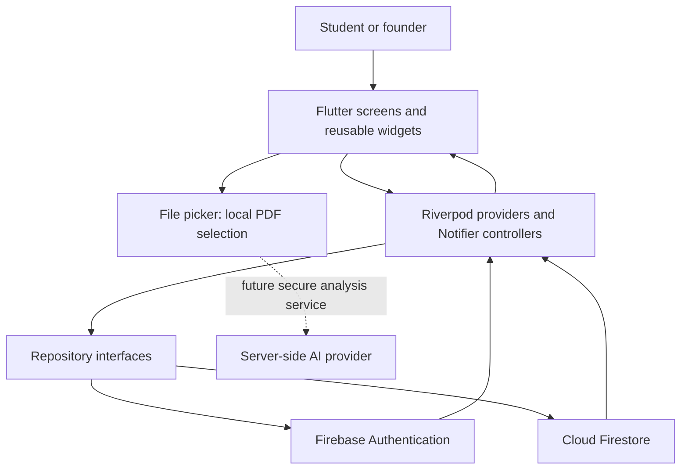
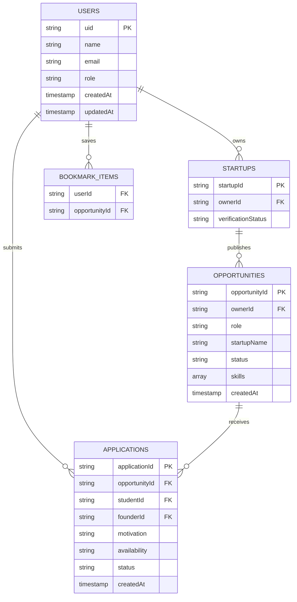

# Unfold: A Mobile Opportunity Platform for the ALU Community

**Mobile Application Development — Technical Report**  
**Student:** Rajveer Singh Jolly  
**Platform:** Flutter (Android)  
**Backend:** Firebase  
**Project:** Unfold
**Repository:** https://github.com/SpaceMan619/unfold-alu

## Abstract

Unfold is a role-aware mobile opportunity platform designed for the African Leadership University (ALU) community. It connects students seeking practical experience with student-led ventures seeking early talent. The implemented application supports ALU-restricted authentication, student and founder journeys, opportunity discovery, search and category filtering, saving, application submission, founder-side applicant review, and application-status changes. Flutter provides the cross-platform interface, Riverpod coordinates application state, and Firebase Authentication and Cloud Firestore provide identity and persistent, real-time data. A lightweight Liquid Glass-inspired design system gives the product a distinctive visual identity while retaining readable contrast and touch-friendly controls. The project also includes a clearly marked scaffold for future CV-assisted matching; document selection is implemented, but AI analysis is not presented as complete. This report explains the product decisions, architecture, security model, testing, limitations, and route to scale.

## 1. Problem and Context

Students often encounter opportunities through fragmented channels such as group chats, mailing lists, and personal networks. This makes discovery inconsistent and gives founders no standard process for publishing roles or reviewing applicants. The problem is especially relevant in an entrepreneurial learning environment: ALU describes its educational approach as mission-driven and focused on developing leaders who address challenges across Africa [1]. A useful campus product should therefore connect learning, venture building, and meaningful work rather than imitate a generic public job board.

Unfold addresses three practical needs:

1. Students need one trusted place to discover relevant roles and track applications.
2. Student founders need a simple way to publish roles and move applicants through a review pipeline.
3. The community needs identity and data boundaries so that private application content is not public.

The product name represents the gradual development of a student's skills, network, and career direction. The core proposition is: **discover meaningful work in the ALU community and make each next step visible**.

## 2. Requirements and User Workflows

The system has two primary roles.

### 2.1 Student workflow

A student signs in with an eligible ALU Google account or registers with email and password, chooses the student role, and enters the discovery experience. The student can search by role, startup, description, or skill; use category filters; open a detailed opportunity sheet; save roles; and submit an application containing a motivation, availability, and optional portfolio link. Tapping “Start application” only opens this validated form; it never submits immediately. Submitted applications appear in the applications area. The external-view profile supports a compressed square profile image and PDF CV selection for the future matching workflow.

### 2.2 Founder workflow

A founder selects the founder role and enters a founder studio. From this interface, the founder can create, edit, close, or delete an opportunity and review applicants. Every listing explicitly records whether it is paid. Paid roles require a positive monthly amount and either Rwandan francs (RWF) or US dollars (USD). Applications can move through `submitted`, `reviewing`, `shortlisted`, `accepted`, or `rejected`. These states are represented by a Dart enum and persisted as strings in Firestore.

### 2.3 Trust and verification

The data model includes startup verification status and rules that reserve verification changes for an administrator. Founders may create a startup with `pending` status, but cannot approve themselves. The current mobile build focuses on student and founder experiences; a complete administrator verification interface remains future work.

## 3. System Architecture

Unfold uses a feature-first architecture. UI widgets depend on Riverpod providers/controllers, which depend on repository interfaces. Firebase implementations sit behind those interfaces. This separation keeps presentation code independent from Firestore syntax and permits controller testing with in-memory fakes.

The application starts in `main.dart`, initializes Firebase using generated `firebase_options.dart`, and wraps the widget tree in `ProviderScope`. `AuthGate` renders the correct screen from `SessionStage`: loading, signed out, role selection, onboarding, or authenticated. This avoids manually pushing authentication routes and makes restored sessions deterministic.

Flutter was selected because its widget model and hot-reload workflow support rapid, consistent mobile interface development [2]. Material components provide accessibility-aware interaction foundations, while custom widgets supply Unfold's identity. Riverpod was selected for explicit dependency injection, observable state, and test overrides. Controllers use `Notifier`, and views rebuild only when watched provider values change.

## 4. Domain and State Management

The principal domain objects are `UserProfile`, `Opportunity`, and `OpportunityApplication`.

- `SessionController` listens to Firebase authentication changes, restores a Firestore user profile, registers users, handles Google sign-in, completes role selection, and signs out.
- `OpportunityActivityController` combines active opportunities, saved IDs, and applied IDs. It streams active Firestore opportunities and student applications. It also performs optimistic UI updates for application submission and rolls back when persistence fails.
- `ApplicationReviewController` streams founder applications and optimistically updates a status, restoring the previous list if Firestore rejects the write.
- `CvAnalysisController` currently owns PDF selection/removal state only. Its stages anticipate later analysis (`empty`, `selected`, `analyzing`, `ready`, `failed`), but no AI provider is connected.

Repository interfaces define the persistence contract. `FirestoreOpportunityRepository` watches active roles and supports create, update, and delete. `FirestoreApplicationRepository` supports student/founder streams, submission, status updates, and withdrawal. This design makes Firebase replaceable and enables isolated tests.

Seed opportunities are used as presentation fallback when the live opportunity collection is empty. They make the discovery interface demonstrable, but are not represented as user-created persistent records. Bookmarks persist to a private per-user Firestore path with optimistic updates and a local fallback for temporary connectivity failures.

## 5. Firebase Design

Firebase Authentication provides email/password and Google authentication. Google accounts are restricted in application logic to `@alustudent.com` or `@alueducation.com`, and Firestore creation rules repeat this requirement through the authenticated email claim. Firebase recommends listening to authentication state to determine the current user, which matches the `authStateChanges()` implementation [3].

Cloud Firestore supplies real-time snapshots for active opportunities and applications [4]. Its document model suits the app because opportunities and applications are independent entities queried by status, student ID, or founder ID.

### 5.1 Collections

- `users/{uid}` stores identity, role, and timestamps.
- `startups/{startupId}` stores ownership and verification state.
- `opportunities/{opportunityId}` stores venture roles and the owning founder ID.
- `applications/{applicationId}` stores the student/founder relationship, answers, and status.
- `bookmarks/{uid}/items/{opportunityId}` is reserved for private saved roles.

### 5.2 Security rules

Firestore Security Rules enforce authorization at the backend, not merely in hidden UI [5]. Users may create only their own ALU-domain profile. A user's role cannot be changed through normal profile updates. Opportunity creation requires a founder, while mutation requires either the owning founder or an administrator. An application may be created only by its student and only in `submitted` state. For live opportunities, the rule verifies that the submitted `founderId` equals the opportunity's `ownerId`. Only that founder or an administrator can change status, and immutable relationship fields must remain unchanged. Students can delete only their own application. Bookmark access is limited to the matching user ID.

Storage rules reserve private paths under `users/{uid}/cvs/` with a 10 MB PDF limit, profile images with a 2 MB post-processing limit, and startup assets with a 5 MB limit. The profile picker rejects source images above 8 MB, center-crops to 1024 × 1024, compresses to JPEG, uploads the result, and stores its download URL in the user document. The Firebase project's Storage product still requires its one-time Console activation before this upload can succeed. PDF upload to Firebase Storage is not yet connected to the interface; the current CV control selects a local PDF only.

Indexes are declared for opportunity status/creation time and application student/creation time. The present queries do not all sort by creation time, but the indexes anticipate ordered feeds.

## 6. UI/UX and Liquid Glass Interpretation

The interface uses a neutral black-and-white foundation, venture-specific accents, warm amber identity elements, rounded geometry, and Plus Jakarta Sans typography. The visual hierarchy is deliberately stronger than a collection of plain Material cards: prominent editorial headings introduce each task, sourced startup logos and verification pills support scanability, and a floating pill navigation bar keeps primary destinations reachable. The student profile uses an external-viewer composition inspired by social profiles: header artwork, overlapping round identity mark, bio, location and education metadata, profile signals, editable skills and interests, and CV evidence.

`GlassSurface` is the core reusable component. It clips content to a rounded rectangle, adds a restrained tonal gradient, draws a low-opacity border and top highlight, and casts a short soft shadow. Early builds used repeated live backdrop blur, but physical-device testing exposed scroll jank. The final design removes that expensive per-card operation while preserving depth through static paint layers. This correction improved motion without reducing text or image resolution.

Usability was prioritized alongside appearance:

- Buttons and role cards use large touch targets.
- Search updates results immediately and empty results show a purposeful state.
- Pull-to-refresh is available across student and founder pages and invalidates live Riverpod data sources.
- Forms validate required answers before submission.
- Opportunity cards and detail sheets always state paid/unpaid status; paid listings show currency and monthly amount.
- Optimistic updates provide immediate feedback but roll back on failure.
- Match percentages are hidden until CV/skill evidence exists, avoiding fabricated personalization.
- The student and founder navigation structures expose the tasks relevant to each role.

The approach is “Liquid Glass-inspired,” not a claim of pixel-identical iOS rendering. The goal is a coherent Android experience with translucency, depth, responsive ink effects, and readable contrast.

## 7. Testing and Quality Assurance

The project includes model, controller, and widget tests. Test coverage targets behaviour rather than screenshots alone:

- application mapping preserves form values through Firestore-style serialization;
- onboarding validates input and supports role selection;
- session restoration uses a fake authentication repository;
- opportunity creation uses a fake repository;
- application forms reject incomplete answers and submit complete ones;
- founder review changes application state and exercises repository-backed updates;
- the main widget flow verifies key interaction points.

Riverpod provider overrides are central to these tests because they replace Firebase repositories and session state with controlled test values. Static analysis with `flutter analyze` supplements runtime tests by enforcing the configured lint rules. Firebase rules should additionally be tested with the Firebase Local Emulator Suite before production deployment; Firebase documents the emulator as the preferred safe environment for local rules and backend testing [7].

## 8. Scalability and Maintainability

The repository boundary permits future caching, pagination, or a different backend without rewriting screens. Firestore listeners provide a simple real-time model for the present scale. At larger scale, opportunity discovery should use pagination, server-maintained category fields, and indexed queries instead of downloading all active roles and filtering on-device. Application documents are intentionally top-level so founders and students can query their own pipeline without collection-group complexity.

Other scaling measures include:

- Cloud Functions for trusted notifications and AI orchestration;
- server-created custom claims for administrator authority;
- App Check and rate limiting for abuse resistance;
- denormalized startup summaries on opportunity documents for fast feed rendering;
- Cloud Messaging for background status notifications;
- analytics events for funnel measurement;
- image resizing and caching for startup media.

## 9. Challenges and Lessons

The first challenge was balancing a distinctive interface with a short delivery window. A reusable glass primitive and repeated spacing/color tokens produced consistency faster than individually styling every card. The second was avoiding UI-only authorization. Role-aware navigation improves usability, but Firestore rules remain the actual security boundary. The third was integrating Google authentication on Android. Correct Firebase Android configuration and provider setup were required in addition to Flutter code.

The most important architectural lesson was to separate state from persistence. Optimistic controllers create a responsive experience, while repositories contain backend details and make unit testing possible. Another lesson was to distinguish “prepared” from “implemented”: storage rules and CV states can support a future feature, but they do not make AI analysis complete.

## 10. Limitations and Future Work

The current build has important limitations:

1. CV intelligence is a scaffold. A user can select or remove a PDF, but it is not uploaded or analyzed.
2. Match scoring is intentionally locked until profile evidence exists. No AI-generated ranking is claimed.
3. Startup verification is handled in Firebase Console; a dedicated administrator mobile screen is not implemented.
4. Bookmark persistence has a local fallback, but production offline reconciliation deserves broader testing.
5. Empty Firestore feeds fall back to sourced seed content for demonstration.
6. Production hardening still needs emulator-based security-rule tests, App Check, accessibility auditing, and broader device testing.

The proposed CV feature would upload a PDF to the authenticated user's protected Storage path, invoke a Cloud Function, send the document to a server-side AI provider, validate a strict structured response, and let the student edit extracted skills before matching. API credentials must remain in server-side secret storage; they must never be embedded in the Flutter application. Matching should remain explainable and should recommend opportunities rather than make hiring decisions. A deterministic formula could combine required-skill overlap, preferred skills, mission alignment, availability, and work arrangement. This preserves human agency and makes recommendations testable.

## 11. Conclusion

Unfold demonstrates a focused mobile workflow for connecting ALU student talent with student-led ventures. Its strongest implemented qualities are role-aware ALU authentication, a clear opportunity/application journey, Firestore-backed repositories and security rules, Riverpod state separation, founder review controls, and a coherent glass-inspired interface. The application is designed to grow without misrepresenting future functionality: AI CV analysis remains a clearly defined next phase. The result is a practical foundation that aligns technical choices with a real community need.

## References

[1] African Leadership University, “About ALU,” *ALU*. [Online]. Available: https://www.alueducation.com/about/ [Accessed: 12-Jul-2026].  
[2] Flutter, “Flutter architectural overview,” *Flutter Documentation*. [Online]. Available: https://docs.flutter.dev/resources/architectural-overview [Accessed: 12-Jul-2026].  
[3] Firebase, “Manage users in Firebase,” *Firebase Authentication Documentation*. [Online]. Available: https://firebase.google.com/docs/auth/flutter/manage-users [Accessed: 12-Jul-2026].  
[4] Firebase, “Get realtime updates with Cloud Firestore,” *Firebase Documentation*. [Online]. Available: https://firebase.google.com/docs/firestore/query-data/listen [Accessed: 12-Jul-2026].  
[5] Firebase, “Get started with Cloud Firestore Security Rules,” *Firebase Documentation*. [Online]. Available: https://firebase.google.com/docs/firestore/security/get-started [Accessed: 12-Jul-2026].  
[6] Flutter, “BackdropFilter class,” *Flutter API Documentation*. [Online]. Available: https://api.flutter.dev/flutter/widgets/BackdropFilter-class.html [Accessed: 12-Jul-2026].  
[7] Firebase, “Connect your app to the Cloud Firestore Emulator,” *Firebase Documentation*. [Online]. Available: https://firebase.google.com/docs/emulator-suite/connect_firestore [Accessed: 12-Jul-2026].  
[8] Firebase, “Cloud Storage Security Rules,” *Firebase Documentation*. [Online]. Available: https://firebase.google.com/docs/storage/security [Accessed: 12-Jul-2026].
